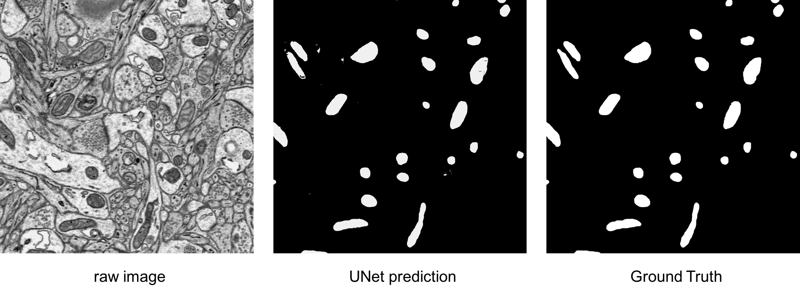

## About

Reference paper: [U-Net: Convolutional Networks for Biomedical Image Segmentation](https://arxiv.org/pdf/1505.04597v1.pdf)


A brief UNet ***tensorflow*** implementation. It can work well on our dataset, see images below. If data augmentation and more strategies are added,
the performance will be better.




+ You just need to config the **config.py** to fit your own datast, see [Dataset](#dataset). When the configuration is finished, you can just run and test the model.
+ The code will be updated with namescope, tfrecord, and more summaries.

    

## Environment

+ Anaconda(python 2.7)
+ Tensorflow 1.10

## <span id = 'dataset'>Dataset</span>

The dataset can be organized as follows:

```
|-- data_path
        |-- img_dir_name
        |-- annotation_dir_name
        |-- train_list_file
        |-- trainval_list_file

```

## Train

> python train.py

## Test

> python predict.py


